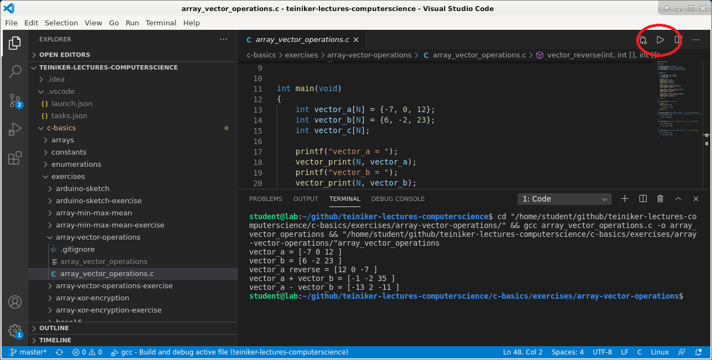

# Visual Studio Code

## Run C Programs

If we implement a **singe C file** including a main() function, we open the C file
and click the run button on the upper right corner of the IDE.



The C file will be compiled and executed.

Tip: To show the program output on the terminal window, go to the menu 
`File/Preferences/Settings >Extensions/Run Code configuration`
and activate the `Code-runner: Run in Terminal` checkbox.

In the case that our **program contains many source files** (`*.c` and `*.h` files),
we use **make** to build the executable.
These examples are shipped with a `Makefile` which specifies all steps needed
to build an executable.
Simply go to the example's directory: use the `cd` command in the terminal or right-click 
on the folder in the **Explorer** view and select `Open in Integrated Terminal`.
Make sure that you are in the right location using the `chdir` command and execute `make`:
```
> chdir
D:\github\teiniker-lectures-computerscience\c-basics\modules\vector-operations

> make
mkdir -p build
gcc -std=c99 -g -Wall   -c vector_operations.c -o build/vector_operations.o
gcc -std=c99 -g -Wall   -c main.c -o build/main.o
gcc -std=c99 -g -Wall   build/vector_operations.o build/main.o -o build/main
build/main
vector_a = [-7 0 12 ]
vector_b = [6 -2 23 ]
vector_a reverse = [12 0 -7 ]
vector_a + vector_b = [-1 -2 35 ]
vector_a - vector_b = [-13 2 -11 ]
```
Note that `make` will also execute the built program.
If we want to run the executable again, we start it in the `build` folder:
```
> build\main
vector_a = [-7 0 12 ]
vector_b = [6 -2 23 ]
vector_a reverse = [12 0 -7 ]
vector_a + vector_b = [-1 -2 35 ]
vector_a - vector_b = [-13 2 -11 ]
```

## Debugging C Programs

We can debug a single file by switching into the debug view, click `Run and Debug` and select 
`C++(GDB/LLDB)`. This creates the following `launch.json` file:
```
{
    "version": "0.2.0",
    "configurations": [
        {
            "name": "gcc - Build and debug active file",
            "type": "cppdbg",
            "request": "launch",
            "program": "${fileDirname}/${fileBasenameNoExtension}",
            "args": [],
            "stopAtEntry": false,
            "cwd": "${workspaceFolder}",
            "environment": [],
            "externalConsole": false,
            "MIMode": "gdb",
            "setupCommands": [
                {
                    "description": "Enable pretty-printing for gdb",
                    "text": "-enable-pretty-printing",
                    "ignoreFailures": true
                }
            ],
            "preLaunchTask": "C/C++: gcc build active file",
            "miDebuggerPath": "/usr/bin/gdb"
        }
    ]
}
```
Now we can open our C file, set a **breakpoint** and run the debugger by clicking the 
**run button** on the left top corner of the IDE.


To debug an executable which we have built using `make`, we have to change the `launch.json`
file: 
* **Remove the "preLaunchTask" element** to stop the automatic compiling before debugging.

  Remove the following line:
  ```
    "preLaunchTask": "C/C++: gcc build active file",
  ```  

* **Change the "program" element** to point to the executable created by make within the `build` folder:

  Change from:  
  ```
    "program": "${fileDirname}/${fileBasenameNoExtension}",
  ```  
  to:	 
  ```
    "program": "${fileDirname}/build/${fileBasenameNoExtension}",    
  ```    

Note that we have to open the `main.c` file before we start the debugger because the `${fileBasenameNoExtension}`
variable contains the current opened file's basename.

Here the final `launch.json` file:
```
{
    "version": "0.2.0",
    "configurations": [
        {
            "name": "gcc - Build and debug active file",
            "type": "cppdbg",
            "request": "launch",
            "program": "${fileDirname}/build/${fileBasenameNoExtension}",
            "args": [],
            "stopAtEntry": false,
            "cwd": "${workspaceFolder}",
            "environment": [],
            "externalConsole": false,
            "MIMode": "gdb",
            "setupCommands": [
                {
                    "description": "Enable pretty-printing for gdb",
                    "text": "-enable-pretty-printing",
                    "ignoreFailures": true
                }
            ],
            "miDebuggerPath": "/usr/bin/gdb"
        }
    ]
}
```


## References 
* [Basic Editing](https://code.visualstudio.com/docs/editor/codebasics)
* [Debugging](https://code.visualstudio.com/docs/editor/debugging)
* [Variables Reference](https://code.visualstudio.com/docs/editor/variables-reference) 