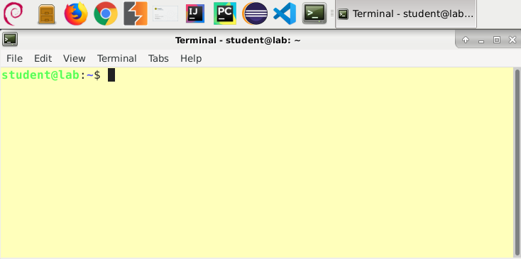

# Bourne Shell

A **shell** is a program that runs commands which the user enter.

The shell also serves as a small **programming environment**.
Many important parts of the system are **shell scripts** - text files that contain a sequence of shell commands.

There are many different Unix shells, but all derive several of their fetures from the **Bourne shell** 
in order to function correctly.
Linux uses an enhanced version of the Bourne shell called **bash** or the **Bourne-again shell**.
The bash shell is the default shell on most Linux distributions. 

Before we can start with our examples, make sure that you have opened a **Terminal Window** on your Linux machine.


Inside a terminal, we can use the following **shortcuts**:
* `[ctrl] + [c]` Exit running process.
* `[ctrl] + [+]` Terminal font size +
* `[ctrl] + [-]` Terminal font size -
* `[ctrl] + [shift] + [c]` Copy marked text 
* `[ctrl] + [shift] + [v]` Paste text


## Standard Input and Standard Output 
Unix processes use **I/O files** to read and write data.

Programs such as `ls` actually send their results to a special file called **standard output** (`stdout`)
and their status messages to another file called **standard error** (`stderr`).
By default, both stdout and stderr are linked to the screen and not saved into a disk file.

In addition, many programs take input from a file called **standard input** (`stdin`), which is, by default, attached to the keyboard.


## Getting Help

Linux systems come with a wealth of documentation.

* **man** The man pages will tell us what we need to know for a particular command. For example `man ls`.
    When programs have many options, the manual pages often list the options in some systematic way.
    To search for a manual page by keyword, use the `-k` option: `man -k keyword`.

* **--help** If we are just looking for a certain option for a command, we tra to enter a command followed by `--help`. 

* **info** The GNU project decided to use another format called info. To access an info manual, we use info with the command name:` info ls`.


## Environment Variables 

The shell can store temporary variables, called **shell variables**, containing the values of text strings.
Shell variables are very useful for keeping track of values in scripts, and some shell variables control the way the shell behaves.

To assign a value to a shell variable, use the equal sign `=`. To access the variable use the `$` prefix.

_Example_: 
```
$ CC=gcc 
$ echo $CC
```

An **environment variable** is like a shell variale, but it is not specific to the shell.
The operating system passes all environment valiables to programs that the shell runs, whereas 
shell variables cannot be accessed in the commands we run.

We assign an environment variable with the shell's `export` command.
_Example_: 
```
$ export CC=gcc 
$ echo $CC
```

Environment variables are useful because many programs read them for configuration and options.

* **PATH** This is a special environment variable that contains the **command path**.
    A command path is a list of system directories that the shell searches when trying to locate a command.
    If we run `echo $PATH`, we will see that the path components are separated by colons `:`.

    _Example_: 
    ```
    $ echo $PATH 
    /home/student/.local/bin:/usr/local/bin:/usr/bin:/bin:/usr/local/games:/usr/games
    ```
    
    To tell the shell to look in more places for programs, change the PATH environment variable.
    _Example_: 
    ```
    $ PATH=dir:$PATH 
    ```

## References

* Brian Ward. **How Linux Works**. No Starch Press, 2015
    * Chapter 2: Basic Commands and Directory Hierarchy
    
* [YouTube: Beginner's Guide to the Bash Terminal](https://www.youtube.com/watch?v=oxuRxtrO2Ag)
    * `0:00:00` Working with the File System: Files, Directories, and Navigation
    * `0:35:45` Working with Text Files 
    * `0:46:45` Working with Users 
    * `1:06:30` Working with Processes
    * `1:11:15` Terminal Shortcuts


*Egon Teiniker, 2020-2023, GPL v3.0*    
